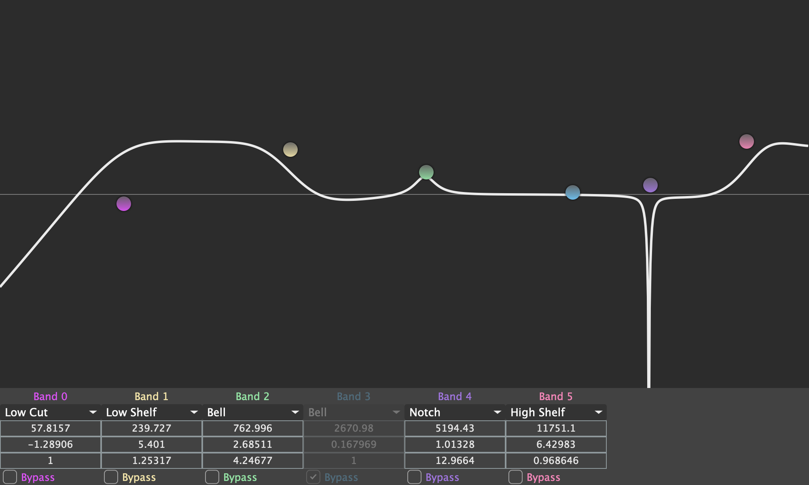

# Easy EQ (Work In Progress)
This is very much a work in progress and is not finished, however the initial idea is there and is useable to some degree. If anybody wants to work with me on getting this finished, feel free to get in touch!

A simple free and open-source equaliser plugin. Built around JUCE classes and concepts to provide a basis for future education around JUCE, GUI and C++ development. Utilises the DSP module's meta-programming techniques to optimise the audio graph at compile time.

## Features
- Eight band fully parametric EQ
- Low CPU usage
- Simple graph-based GUI for quick equalisation setting
- Mac and Windows support
- VST3 and AU support (AAX upcoming)

